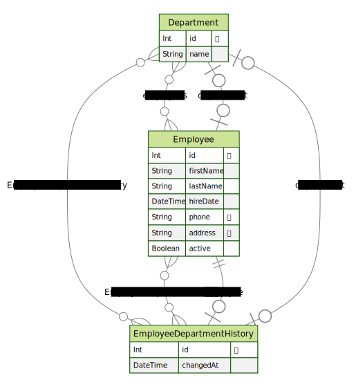

# Project Overview

This repository contains a full-stack application built with **NestJS** (modular + layered architecture) on the backend and **React** (feature-based + layered architecture) on the frontend. The code adheres to **SOLID principles**, **Clean Code**, and includes **unit testing**, offering a solid foundation for scalable and maintainable development.

---

## Table of Contents

1. [Backend](#backend)  
   1.1 [Key Features](#key-features)  
   1.2 [Testing](#testing)  
   1.3 [Data Modeling](#data-modeling)  
2. [Infrastructure & CI/CD](#infrastructure--cicd)  
3. [Frontend](#frontend)  
   3.1 [Key Features](#key-features-1)  
   3.2 [UI Features](#ui-features)  
   3.3 [Testing](#testing-1)  
4. [How to Run](#how-to-run)  
5. [Next Steps](#next-steps)

---

## Backend

### Key Features

- **Stack:** NestJS, TypeScript, PostgreSQL, Prisma
- **Architecture:**
  - Modular and layered design following NestJS standards.
  - Each domain is encapsulated in a module.
  - Clean separation of concerns between layers (Controller, Service, Repository).
- **Best Practices:**
  - Follows SOLID principles and Clean Code guidelines.
- **Event-Driven Design:**  
  Implements domain events to persist department history.
- **API Documentation:**  
  Auto-generated via Swagger.
- **Database Migrations:**  
  Handled through Prisma Migrate.

### Testing

- Unit tests using **Jest**.

### Data Modeling

Entity-Relationship Diagram available in `/assets`:



---

## Infrastructure & CI/CD

- **Containerization:** Docker & Docker Compose
- **Image Registry:** Ready for publishing (e.g., Docker Hub)
- **Recommendations:**
  - Set up CI/CD pipeline (e.g., GitHub Actions) for:
    - ✅ Linting
    - ✅ Testing
    - ✅ Automated builds and deployments
  - Consider Kubernetes for orchestration and scalability

---

## Frontend

### Key Features

- **Stack:** React, TypeScript, TailwindCSS, ShadCN, Framer Motion, React Query
- **Architecture:** Feature-based + layered

#### Why This Architecture?

- **Modular Organization:**  
  Each feature (e.g., Employees, Departments, Users) is self-contained
- **Scalable:**  
  Easy to add new features without breaking existing code
- **Separation of Concerns:**  
  Domain logic, UI, and API are well-isolated
- **Testable:**  
  Each layer is independently testable
- **Team-Friendly:**  
  Reduces merge conflicts and supports parallel development

### UI Features
- **Employee Management:** Create, read, update, and delete employee records.
- **Mobile Responsiveness:** The application is designed to be responsive and user-friendly on mobile devices.
- **Dark Mode:** Supports dark mode for better user experience.

### Testing

- Unit tests with **Vitest** and **React Testing Library**  

## How to Run 

You can run the project in two different modes, depending on your goals:

### 🔧 1. Development Mode (local build)

1. **Clone** the repository and navigate to the **root directory**.
2. **Build and run** the containers with:
   ```bash
   docker compose -f docker-compose.development.yml up --build -d
   ```

### 🔧 2. Production Mode (pre-built images)

1. **Clone** the repository and navigate to the **root directory**.
2. **Build and run** the containers with:
   ```bash
    docker compose up -d
   ```

## Next steps

- **Backend:**
  - Add integration with a file storage service (e.g., AWS S3) to manage employee photos.
  - Develop integration and end-to-end tests for comprehensive validation.
  - Explore caching strategies (e.g., Redis) for performance optimization.
  - Integration and end-to-end tests for more comprehensive coverage.
- **Frontend:**
  - Increase unit test coverage.
  - Add integration and end-to-end tests for user flows.
  - Implement virtualization and pagination to efficiently handle scenarios with large employee lists.
  - Create storybook for UI components to enhance reusability and documentation.
  - Improve interface with micro interactions and animations for a better user experience.
  - Add tools for editing employee avatars.
- **Infrastructure:**
  - Set up a CI/CD pipeline for automated testing and deployment.
  - Consider using Kubernetes for orchestration and scaling.
  - Implement monitoring and logging solutions (e.g., Prometheus, Grafana) for better observability.
- **User Experience:**
  - Enhance the user interface with better design patterns and user feedback mechanisms.
  - Implement responsive design for better mobile compatibility.
  - Add accessibility features to ensure the application is usable by everyone.
